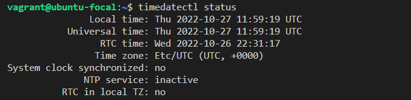
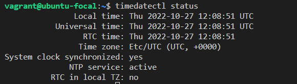

# Disable IPv6

### If IPv6 or dual stack is not to be used, it is recommended that IPv6 be disabled to reduce the attack surface of the system.

# Ensure Avahi Server is not Installed

## Description:

Avahi is a free zeroconf implementation, including a system for multicast DNS/DNS-SD service discovery. Avahi allows programs to publish and discover services and hosts running on a local network with no specific configuration. For example, a user can plug a computer into a network and Avahi automatically finds printers to print to, files to look at and people to talk to, as well as network services running on the machine.

### Rationale

Automatic discovery of network services is not normally required for system functionality. It is recommended to remove this package to reduce the potential attack surface.

# Ensure CUPS is not installed

## Description:

The Common Unix Print System (CUPS) provides the ability to print to both local and network printers. A system running CUPS can also accept print jobs from remote systems and print them to local printers. It also provides a web based remote administration capability.

### Rationale:

If the system does not need to print jobs or accept print jobs from other systems, it is recommended that CUPS be removed to reduce the potential attack surface.

# Ensure DHCP Server is not installed

## Description:

The Dynamic Host Configuration Protocol (DHCP) is a service that allows machines to be dynamically assigned IP addresses.

### Rationale:

Unless a system is specifically set up to act as a DHCP server, it is recommended that this package be removed to reduce the potential attack surface.

# Ensure DNS Server is not installed

## Description:

The Domain Name System (DNS) is a hierarchical naming system that maps names to IP addresses for computers, services and other resources connected to a network.

### Rationale:

Unless a system is specifically designated to act as a DNS server, it is recommended that the package be deleted to reduce the potential attack surface.

# Ensure FTP Server is not installed

## Description:

The File Transfer Protocol (FTP) provides networked computers with the ability to transfer files.

### Rationale:

FTP does not protect the confidentiality of data or authentication credentials. It is recommended SFTP be used if file transfer is required. Unless there is a need to run the system as a FTP server (for example, to allow anonymous downloads), it is recommended that the package be deleted to reduce the potential attack surface.

# Ensure IMAP and POP3 server are not installed

## Description:

dovecot-imapd and dovecot-pop3d are an open source IMAP and POP3 server for Linux based systems.

### Rationale:

Unless POP3 and/or IMAP servers are to be provided by this system, it is recommended that the package be removed to reduce the potential attack surface.

# Ensure LDAP server is not installed

## Description:

The Lightweight Directory Access Protocol (LDAP) was introduced as a replacement for NIS/YP. It is a service that provides a method for looking up information from a central database.

### Rationale:

If the system will not need to act as an LDAP server, it is recommended that the software be removed to reduce the potential attack surface.

# Ensure systemd-timesyncd is configured

## Description:

systemd-timesyncd is a daemon that has been added for synchronizing the system clock across the network. It implements an SNTP client. In contrast to NTP implementations such as chrony or the NTP reference server this only implements a client side, and does not bother with the full NTP complexity, focusing only on querying time from one remote server and synchronizing the local clock to it. The daemon runs with minimal privileges, and has been hooked up with networkd to only operate when network connectivity is available. The daemon saves the current clock to disk every time a new NTP sync has been acquired, and uses this to possibly correct the system clock early at bootup, in order to accommodate for systems that lack an RTC such as the Raspberry Pi and embedded devices, and make sure that time monotonically progresses on these systems, even if it is not always correct. To make use of this daemon a new system user and group "systemd-timesync" needs to be created on installation of systemd.

### Rationale:

Proper configuration is vital to ensuring time synchronization is working properly.

### Before configuration

### After configuration

# Ensure time synchronization is in use

## Description:

System time should be synchronized between all systems in an environment. This is typically done by establishing an authoritative time server or set of servers and having all systems synchronize their clocks to them.

### Rationale:

Time synchronization is important to support time sensitive security mechanisms like Kerberos and also ensures log files have consistent time records across the enterprise, which aids in forensic investigations.

